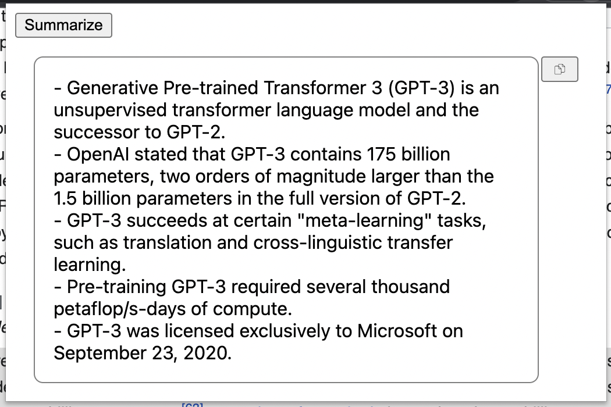

# GPT-Summarize

A Chrome extension that allows users to select text and summarize it using OpenAI's GPT-3 API. This was written using Chat-GPT's guidance.

## Features

- Select text from any webpage and summarize it with a single click
- View the summarized text in a pop-up window
- Copy the summarized text to the clipboard

## Installation

1. Download or clone this repository
2. Add your OpenAI API key to [background.js](background.js)
2. Open Google Chrome and go to the extensions page (chrome://extensions/)
3. Enable Developer Mode by clicking the toggle switch in the top right corner
4. Click the "Load Unpacked" button and select the directory containing this repository
5. The extension will be installed and added to your browser

## Usage

1. Select the text you want to summarize
2. Click the plugin icon and click "Summarize"
3. The summarized text will be displayed in a pop-up window

## Dependencies

- [OpenAI's GPT-3 API](https://beta.openai.com/docs/api-reference/completions/create)
- [Chrome Extension API](https://developer.chrome.com/extensions/api_index)
